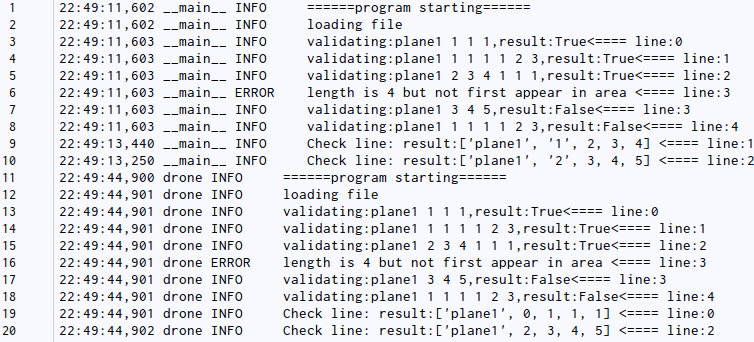
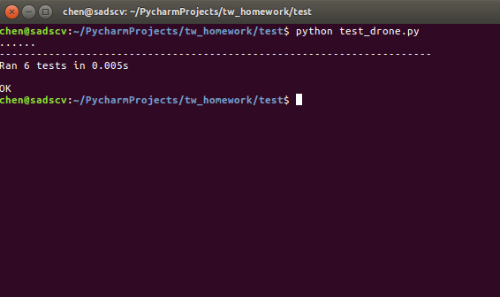

## 介绍

## 运行程序
* 程序在 Linux(Ubuntu 16.04 64bit) && Python3 环境下编写，并通过测试，理论上Python2兼容。

###### 进入文件夹:

	$ cd tw_homework #进入文件夹
	
###### 替换路径:
将当前路径导入PYTHONPATH环境变量，防止出现import error问题

以下为示例，请将路径替换为本地路径

	$ export PYTHONPATH=$PYTHONPATH:/home/chen/PycharmProjects/tw_homework
	
###### 初始化:
需带上data文件路径参数

	$ python3 drone.py file.txt	
	
###### 查询：
输入所查询序号,整体如图所示

###### 日志示例

## 测试

*  单元测试包括Drone类下所有方法测试，包括输入测试及返回值测试
*  各种类型的输入测试，如路径错误，参数数量异常，坐标异常，参数类别异常等

###### 运行方法：
切换目录至./test/, 再运行,如图，全部通过测试

    & python3 test_drone.py
    

    
## 实现思路

   本程序将飞行数据处理过程进行抽象，封装为`class Drone()`, 其具有如下几个方法
   
   * `def readfile(self, filepath)` 读取数据文件，逐行将该行信号送给`valid_signal`校验，校验通过则更新坐标，未通过则将本机状态置为故障
   * `def valid_signal(self, signal)` 根据无人机当前状态，依照需求文档中的各项规则，判断该行信号是否有效
   * `def fly(self, offset)` 接收一个偏移量，初步校验无误后，更新无人机当前坐标
   * `def is_digit(num)` 静态方法, 判断一个字符串是否为正负整数或0
   * `def check(self. line)` 查验当前机器在第`line`条记录时的坐标
   
   当实例化一个Drone对象时，正常使用时需带上参数‘文件路径'，对象在初始化过程将将逐条扫描文件，并生成对应规则的坐标轨迹并保存在self.paths列表中。
   
## 一些亮点
* 相对完整的单元测试, 帮助提高程序稳定性
* 加入了日志功能, 辅助监控程序状态
* 引入了面向对象设计, 提高了程序的可扩展性和可维护性。
* 考虑到了一些可能会变动的需求,如:
    - 坐标维度的可能变化,例如增加实时气压值
    - 坐标类型的变化，可能从整型变为浮点数.